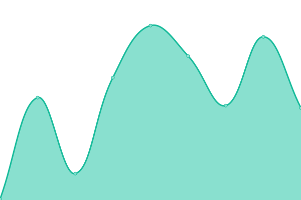
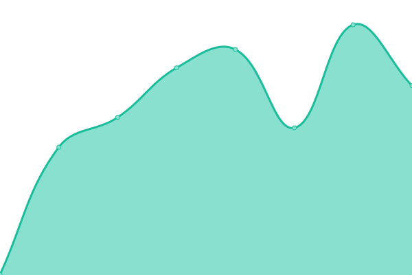
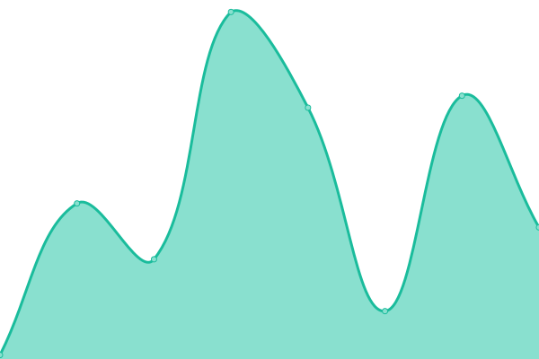

# [📈 Live Status](https://status.hostathing.com): <!--live status--> **🟩 All systems operational**

This repository contains the open-source uptime monitor and status page for [Host A Thing](https://hostathing.com), powered by [Upptime](https://github.com/upptime/upptime).

With [Upptime](https://upptime.js.org), you can get your own unlimited and free uptime monitor and status page, powered entirely by a GitHub repository. We use [Issues](https://github.com/dy1io/status.hostathing.com/issues) as incident reports, [Actions](https://github.com/dy1io/status.hostathing.com/actions) as uptime monitors, and [Pages](https://status.hostathing.com) for the status page.

<!--start: status pages-->
<!-- This summary is generated by Upptime (https://github.com/upptime/upptime) -->
<!-- Do not edit this manually, your changes will be overwritten -->
<!-- prettier-ignore -->
| URL | Status | History | Response Time | Uptime |
| --- | ------ | ------- | ------------- | ------ |
|  [Website](https://hostathing.com) | 🟩 Up | [website.yml](https://github.com/dy1io/status.hostathing.com/commits/HEAD/history/website.yml) | 

 87ms
     
 | 

<a href="https://status.hostathing.com/history/website">100.00%</a>
    

|  [Panel](https://panel.hostathing.com) | 🟩 Up | [panel.yml](https://github.com/dy1io/status.hostathing.com/commits/HEAD/history/panel.yml) | 

 355ms
     
 | 

<a href="https://status.hostathing.com/history/panel">100.00%</a>
    

|  [PanelBot](apex.hostathing.com) | 🟩 Up | [panel-bot.yml](https://github.com/dy1io/status.hostathing.com/commits/HEAD/history/panel-bot.yml) | 

 62ms
     
 | 

<a href="https://status.hostathing.com/history/panel-bot">100.00%</a>
    

|  [Node: Apex](apex.hostathing.com) | 🟩 Up | [node-apex.yml](https://github.com/dy1io/status.hostathing.com/commits/HEAD/history/node-apex.yml) | 

 55ms
     
 | 

<a href="https://status.hostathing.com/history/node-apex">100.00%</a>
    

|  [Node: Orion](orion.hostathing.com) | 🟩 Up | [node-orion.yml](https://github.com/dy1io/status.hostathing.com/commits/HEAD/history/node-orion.yml) | 

 160ms
     
 | 

<a href="https://status.hostathing.com/history/node-orion">99.74%</a>
    

<!--end: status pages-->

[**Visit our status website →**](https://status.hostathing.com)

## 📄 License

- Powered by: [Upptime](https://github.com/upptime/upptime)
- Code: [MIT](./LICENSE) © [Dylan](https://dy1.io)
- Data in the `./history` directory: [Open Database License](https://opendatacommons.org/licenses/odbl/1-0/)
